# Paper Notes

[TOC]

### 1. DropEdge: Towards Deep Graph Convolutional Networks on Node Classification

1. **出版**：ICLR 2020

2. **源码**：[https://github.com/DropEdge/DropEdge](https://github.com/DropEdge/DropEdge)

3. **目的**：解决过拟合和过平滑问题

4. **思想**：在每次训练迭代（*epoch*）过程中，以一定比例随机丢掉的一些边，即设置邻接矩阵的非零元素为0。例如在GCN中其应用公式为：
   $$
   \boldsymbol{H}^{(l+1)}=\sigma\left(\hat{\boldsymbol{A}}_{drop} \boldsymbol{H}^{(l)} \boldsymbol{W}^{(l)}\right)
   $$

   $$
   \hat{\boldsymbol{A}}_{drop}=\hat{\boldsymbol{D}}^{-1 / 2}(\boldsymbol{A}_{drop}+\boldsymbol{I}) \hat{\boldsymbol{D}}^{-1 / 2}
   $$

   $$
   \boldsymbol{A}_{\text {drop }}=\boldsymbol{A}-\boldsymbol{A}^{\prime}
   $$

   其中$A$表示原始的邻接矩阵，$A^{\prime}$表示随机丢弃的边的稀疏矩阵。

5. **优势**

* DropEdge can be considered as a data augmentation technique. By DropEdge, we are actually generating different random deformed copies of the original graph; as such, we augment the randomness and the diversity of the input data, thus better capable of preventing over-fitting. （DropEdge是一种数据增强技术，可生成原图的不同的随机变形副本；则增加输入数据的随机性和多样性能够更好地防止过拟合）

* DropEdge can also be treated as a message passing reducer. In GCNs, the message passing between adjacent nodes is conducted along edge paths. Removing certain edges is making node connections more sparse, and hence avoiding over-smoothing to some extent when GCN goes very deep. Indeed, DropEdge either retards the convergence speed of over-smoothing or relieves the information loss caused by it.（DropEdge还可以视为消息传递减少器。在GCNs中，相邻节点之间的消息传递是沿边缘路径进行的。删除某些边缘会使节点连接更加稀疏，从而在GCN变深时在一定程度上避免过度平滑。实际上，DropEdge要么延缓过平滑的收敛速度，要么减轻过平滑造成的信息损失。）

6. **DropEdge**，**Dropout**，**DropNode**，**Graph-Spardification**区别

* **DropEdge**：drop edges at each training time（随机丢掉某些边，设置邻接矩阵的非零元素为0）；
* **Dropout**：drop feature dimensions（随机丢掉某些特征，即设置特征维度为0）；

* **DropNode**（node sampling）：DropNode samples sub-graphs for mini-batch training, and it can also be treated as a specific form of dropping edges since the edges connected to the dropping nodes are also removed.（随机丢掉某些节点，即设置结点特征向量为零向量）；
* **Graph-Spardification**：Graph-Sparsification resorts to a tedious optimization method to determine which edges to be deleted, and once those edges are discarded the output graph keeps unchanged.（利用某种优化方法决定丢掉哪些边，而不是随机丢弃。并且一旦边被删除后，训练过程中输出图保持不变）。

7. **数据集**

* transductive：Cora, Citeseer and Pubmed（引文数据集）
* inductive：Reddit（社交网络）

8. **可应用的模型**：GCN、ResGCN、JKNet、IncepGCN、GraphSAGE

9. **实验结果**

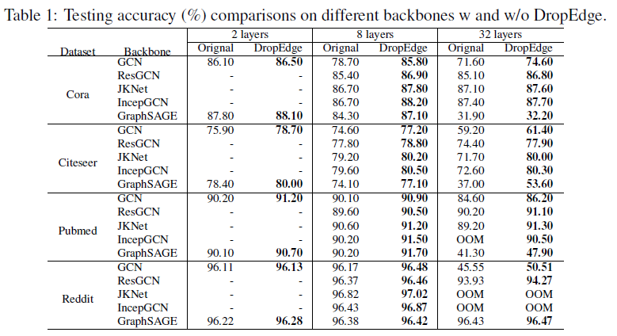

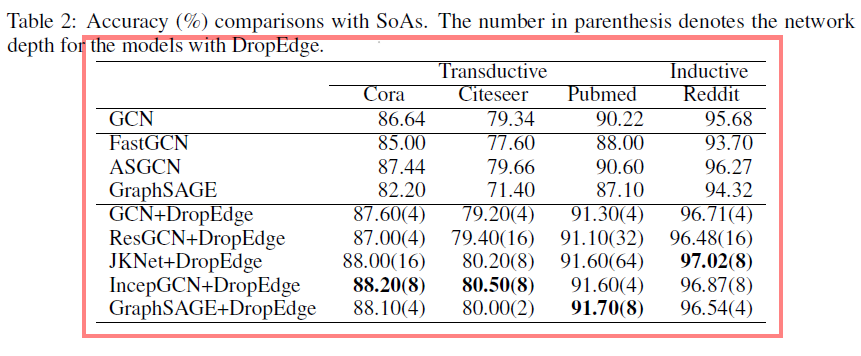

###  2. Simple and Deep Graph Convolutional Networks

1. **出版**：ICML 2020

2. **源码**：[https: //github.com/chennnM/GCNII](https://github.com/chennnM/GCNII)

3. **目的**：防止过平滑，并可利用深层网络结构提高模型的性能

4. **思想**：该论文提出采用初始残差和恒等映射两种简单技术可以缓解过平滑问题。
   
   ​		Defferrard等提出利用图拉普拉斯矩阵的K阶多项式可以进一步拟合图卷积操作，其公式如下：
   $$
   \mathbf{U} g_{\theta}(\Lambda) \mathbf{U}^{T} \mathrm{x} \approx \mathbf{U}\left(\sum_{\ell=0}^{K} \theta_{\ell} \mathbf{\Lambda}^{\ell}\right) \mathbf{U}^{\top} \mathrm{x}=\left(\sum_{\ell=0}^{K} \theta_{\ell} \mathbf{L}^{\ell}\right) \mathrm{x}\tag{1}
   $$
   ​		原版GCN在此基础上设置$K=1, \theta_{0}=2 \theta$$, \theta_{1}=-\theta$，并引入再归一化技巧，公式如下：
   $$
   \mathbf{H}^{(\ell+1)}=\sigma\left(\tilde{\mathbf{P}} \mathbf{H}^{(\ell)} \mathbf{W}^{(\ell)}\right)\tag{2}
   $$
   $$
   \tilde{\mathbf{P}}=\tilde{\mathbf{D}}^{-1 / 2} \tilde{\mathbf{A}} \tilde{\mathbf{D}}^{-1 / 2}
   $$
   
   ​		SGC模型表明通过堆叠K层，GCN在谱域中能够拟合一个K阶的具有固定系数$\theta$的多项式滤波器$\left(\sum_{\ell=0}^{K} \theta_{\ell} \tilde{\mathbf{L}}^{\ell}\right) \mathrm{x}$，而固定的系数将会限制GCN的表达能力，从而引起过平滑问题。因此该论文中GCNII模型则利用初始残差（Initial residual）和恒等映射（Identity mapping）技术使GCN能表达具有任意系数的K阶多项式滤波器。GCNII表达公式如下：

$$
\mathbf{H}^{(\ell+1)}=\sigma\left(\left(\left(1-\alpha_{\ell}\right) \tilde{\mathbf{P}} \mathbf{H}^{(\ell)}+\alpha_{\ell} \mathbf{H}^{(0)}\right)\left(\left(1-\beta_{\ell}\right) \mathbf{I}_{n}+\beta_{\ell} \mathbf{W}^{(\ell)}\right)\right)\tag{3}
$$

​		注意：$H^{(0)}$不一定是特征矩阵。若特征维度过大，可先通过全连接层进行降维。   

​		该方法相比于GCN模型（公式(1)）主要有两处改进：

   * 利用初始残差连接，将平滑表示$\tilde{\mathbf{P}} \mathbf{H}^{(\ell)}$与第一层$\mathbf{H}^{(0)}$相结合；

     > 之前的模型是利用残差连接传递上一层（previous layer）的信息，而GCNII模型构建的是初始表示$H^{(0)}$的连接，即与输入层（input layer）构建连接。初始残差连接能确保每个节点的最终表示至少有$\alpha_{\ell}$比例来自于输入层（特征）。
     >
     > 设置：实验中将$\alpha_{\ell}$简单地设为0.1或0.2。
     >
     > 注意：$H^{(0)}$不一定是特征矩阵$H$。如果特征维度过大，可在前向传播之前对$X$使用全连接神经网络进行降维操作，以获得$H^{(0)}$。

   * 增加一个恒等映射$I_n$到$\ell$层权重矩阵$W^{(\ell)}$中。

     > 动机：
     >
     > 1. 恒等映射能确保深层GCNII模型实现与其浅层版本相同的性能；
     > 2. 在半监督任务中，特征矩阵的不同维度间频繁的相互作用会降低模型的性能，而将平滑表示$\tilde{\mathbf{P}} \mathbf{H}^{(\ell)}$直接映射输出能减少这种作用，从而缓解该问题；
     > 3. 恒等映射在半监督任务中被证实是非常有效的；
     > 4. K层GCN中的节点特征将收敛到一个子空间，从而导致信息损失，而恒等映射能缓解信息损失。
     >
     > 设置$\beta_{\ell}$，其中$\lambda$是超参数：
     > $$
     > \beta_{\ell}=\log \left(\frac{\lambda}{\ell}+1\right) \approx \frac{\lambda}{\ell}
     > $$

     

5. GCNII模型灵感，尤其是恒等映射的使用，源于迭代收缩阈值算法解决LASSO（least absolute shrinkage and selection operator，又译套索算法）优化问题。

6. **数据集**

* 半监督节点分类：Cora, Citeseer, and Pubmed（引文网络数据集）

  > In these citation datasets, nodes correspond to documents, and edges correspond to citations; each node feature corresponds to the bag-of-words representation of the document and belongs to one of the academic topics.
  
* 全监督节点分类：Chameleon , Cornell, Texas, and Wisconsin（web networks）

  > Nodes and edges represent web pages and hyperlinks, respectively. The feature of each node is the bag-of-words representation of the corresponding page.

* inductive learning：Protein-Protein Interaction (PPI) networks（蛋白质-蛋白质相互作用网络，包含24张图）

7. **实验结果**

* 半监督节点分类

  * **Comparison with SOTA**

    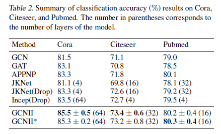

    其中，Drop指DropEdge。GCNII$^*$是GCNII的变体，其对平滑表示$\tilde{\mathbf{P}} \mathbf{H}^{(\ell)}$和初始残差$H^{(0)}$使用不同的权重矩阵。GCNII$^*$公式如下：
    $$
    \begin{aligned}
    \mathbf{H}^{(\ell+1)}=& \sigma\left(\left(1-\alpha_{\ell}\right) \tilde{\mathbf{P}} \mathbf{H}^{(\ell)}\left(\left(1-\beta_{\ell}\right) \mathbf{I}_{n}+\beta_{\ell} \mathbf{W}_{1}^{(\ell)}\right)+\right.\\
    &\left.+\alpha_{\ell} \mathbf{H}^{(0)}\left(\left(1-\beta_{\ell}\right) \mathbf{I}_{n}+\beta_{\ell} \mathbf{W}_{2}^{(\ell)}\right)\right)
    \end{aligned}
    $$

  * **A detailed comparison with other deep models**
  
    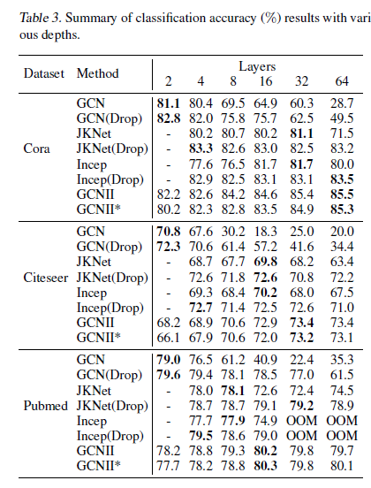

* **全监督节点分类**

  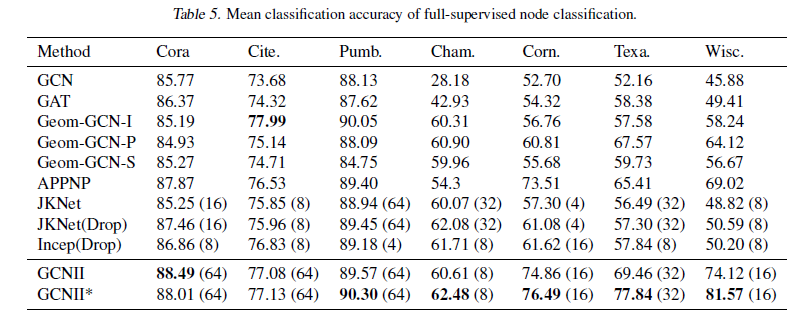

* **Inductive Learning**

  GCNII和GCNII$^*$ 模型均应用9层网络实现该实验结果。
  
  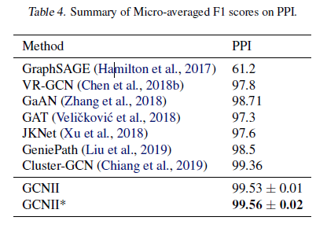

###  3. GResNet: Graph Residual Network for Reviving Deep GNNs from Suspended Animation

1. **出版**：ICLR 2020

2. **源码**：[https://github.com/jwzhanggy/GResNet](https://github.com/jwzhanggy/GResNet)

3. **目的**：研究导致假死问题的原因，并解决该问题。

   > Such a problem happens when the model depth reaches the suspended animation limit, and the model will not respond to the training data any more and become not learnable.

4. **思想**：该模型引入新的图残差项，如Table 1所示：

   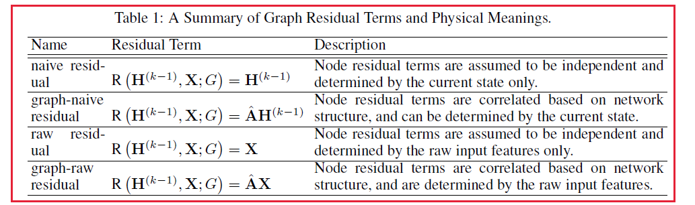

   定义谱图卷积操作以学习节点表示，即GCN如下：
   $$
   \mathbf H=\operatorname {SGC}(\mathbf X;G,\mathbf W)=\operatorname{ReLU}(\mathbf {\hat AXW})
   $$
   假设模型深度为 $K$ 层，即隐藏层和输出层共 $K$ 层，则对应的节点表示的更新公式如下：
   $$
   \left\{\begin{array}{l}
   \mathbf{H}^{(0)}=\mathbf{X} \\
   \mathbf{H}^{(k)}=\operatorname{ReLU}\left(\hat{\mathbf{A}} \mathbf{H}^{(k-1)} \mathbf{W}^{(k-1)}\right), \forall k \in\{1,2, \cdots, K-1\} \\
   \hat{\mathbf{Y}} \quad=\operatorname{softmax}\left(\hat{\mathbf{A}} \mathbf{H}^{(K-1)} \mathbf{W}^{(K)}\right)
   \end{array}\right.
   $$
   将残差学习机制引入GCN模型，节点表示的更新公式将被重写， $\operatorname R(\mathbf H^{(k-1)},\mathbf X;G)$ 可查看Table 1：
   $$
   \left\{\begin{array}{l}\mathbf{H}^{(0)}=\mathbf{X} \\\mathbf{H}^{(k)}=\operatorname{ReLU}\left(\hat{\mathbf{A}} \mathbf{H}^{(k-1)} \mathbf{W}^{(k-1)}+\operatorname R(\mathbf H^{(k-1)},\mathbf X;G)\right), \forall k \in\{1,2, \cdots, K-1\} \\\hat{\mathbf{Y}} \quad=\operatorname{softmax}\left(\hat{\mathbf{A}} \mathbf{H}^{(K-1)} \mathbf{W}^{(K)}+\operatorname R(\mathbf H^{(k-1)},\mathbf X;G)\right)\end{array}\right.
   $$
   图解：

   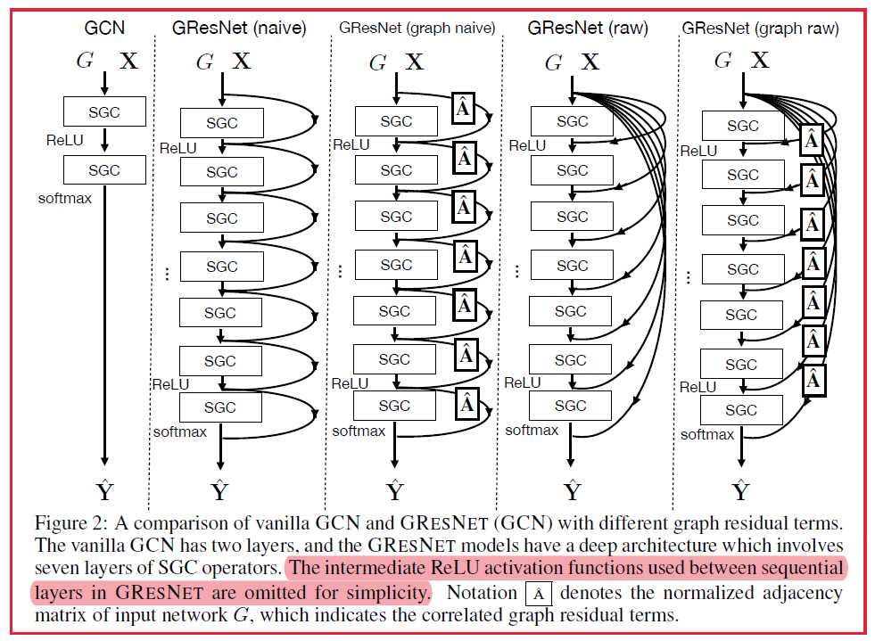

5. **实验结果**

* 分析图残差项的效果

  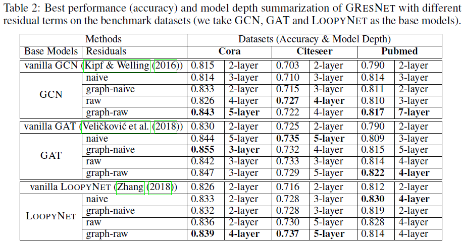

* 与经典的节点分类方法作比较

  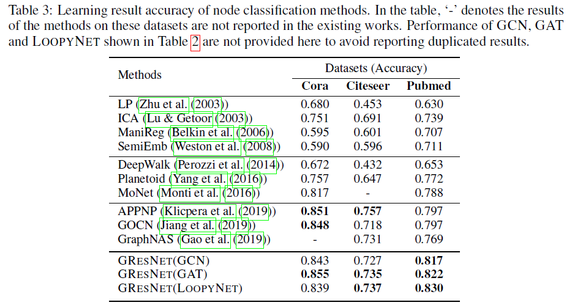

###  4. Text Level Graph Neural Network for Text Classification

1. **出版**：EMNLP  2019
2. **类型**：有向图；将每篇文本视为一张输入图
3. **源码**：[https://github.com/LindgeW/TextLevelGNN](https://github.com/LindgeW/TextLevelGNN)（非源码）
4. **目的**：解决传统GNN模型的高内存消耗问题（due to numerous edges）和不支持新样本预测（transductive learning）的问题。
5. **思想**：不同于为整个语料库仅构建一张图（corpus level graph），该模型采用为每一个输入文本构建一张图（text level graph）。对于一个文本级的图而言，其将所有出现在该文本中的词视为词节点，不存在文本节点，并且词节点将在更小的上下文滑窗内进行相互连接。词节点的表示和边的权重是全局共享且不断更新的。最终的文本表示被计算为该图中所有词节点表示的总和，从而预测标签结果。

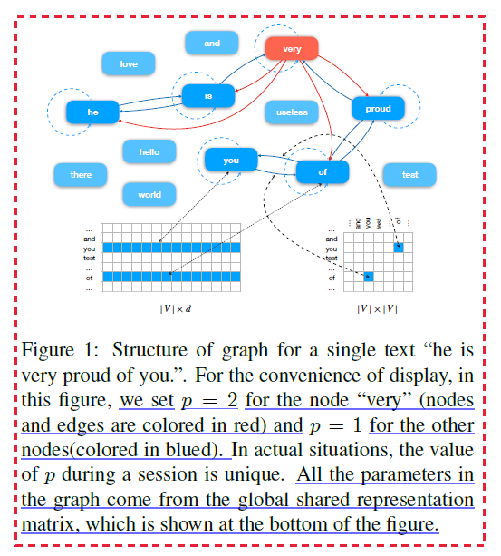

​		**具体说明**：对于包含了 $l$ 个词的文本而言，该模型中对其构建一张text level graph，具体定义如下：
$$
\begin{array}{l}
N=\left\{\mathbf{r}_{\mathbf{i}} \mid i \in[1, l]\right\} \\
E=\left\{e_{i j} \mid i \in[1, l] ; j[i-p, i+p]\right\}
\end{array}
$$
​		其中，$\mathbf{r}_i \in \mathbb{R}^d$ 为第 $i$ 个词节点的向量表示，其利用随机向量或Glove进行初始化，并通过训练不断更新。$p$ 表示邻近词的数量（一侧），即滑窗大小。同时，该模型将训练集中出现次数低于 $k$ 次的边统一映射成“公共”边，使参数充分训练。

​		该模型是基于空间方法的GCN模型，其信息传递机制（MPM）定义如下：
$$
\begin{aligned}
\mathbf{M}_{\mathbf{n}} &=\max _{a \in \mathcal{N}_{n}^{p}} e_{a n} \mathbf{r}_{\mathbf{a}}, \\
\mathbf{r}_{\mathbf{n}}^{\prime} &=\left(1-\eta_{n}\right) \mathbf{M}_{\mathbf{n}}+\eta_{n} \mathbf{r}_{\mathbf{n}}
\end{aligned}
$$
​		其中，$\mathbf{M}_n \in \mathbb{R}^d$ 是节点 $n$ 从邻节点中获得的信息；$\max$ 是每一维度的最大特征选择方法，即挑选每一维中的最大值构成新的输出向量。$\mathbf{r}_a \in \mathbb{R}^d$ 表示节点 $n$ 的邻居节点 $a$ 的向量表示；$e_{an} \in \mathbb{R}^1$ 是对应边的权重，在训练过程中可不断更新。$\mathbf{r}_n \in \mathbb{R}^d$ 是节点 $n$ 更新前的向量表示；$\eta_{n} \in \mathbb{R}^{1}$ 是个可训练的变量，表示有多少 $\mathbf{r}_n$ 的信息应该被保留。$\mathbf{r}_{\mathbf{n}}^{\prime}$ 是节点 $n$ 更新后的特征向量。

​		最终文本中所有节点的特征表示都被用于文本标签的预测，其前向传播公式如下：
$$
y_{i}=\operatorname{softmax}\left(\operatorname{Relu}\left(\mathbf{W} \sum_{n \in N_{i}} \mathbf{r}_{\mathbf{n}}^{\prime}+\mathbf{b}\right)\right)
$$
​		其中，$\mathbf{W} \in \mathbb{R}^{d \times c}$ 是可训练的权重矩阵；$\mathbf{N}_i$ 为文本 $i$ 的节点集合；$\mathrm{b} \in \mathbb{R}^{c}$ 为偏置项。损失函数为交叉熵（单一样本上的误差）：
$$
\text { loss }=-g_{i} \log y_{i}
$$
​		其中，$g_i$ 为独热表示的真实标签。

6. **数据集**

   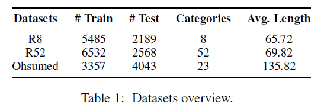

7. **实验结果**

* 与SOTA比较

  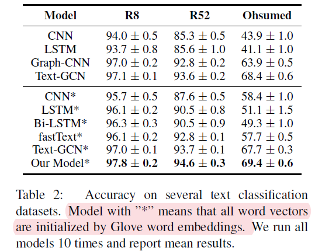

* 内存消耗分析

  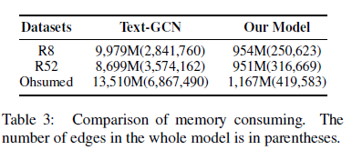

* 边分析（窗口大小 $p$ 值分析）

  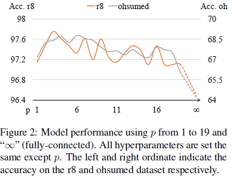

* 消融实验

  （删除模型中的某些特征，观察它是如何影响模型性能）

  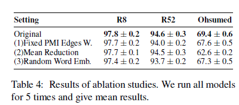

  * （1）固定边的权重，并用PMI算法初始化以及设置滑窗大小为20（同Textgcn）。相较于固定边，可训练的边能更好地建模词之间的关系。
  * （2）将max-reduction改为mean-reduction。max-reduction能突出较大差异的特征并提供非线性特征，从而帮助实现更好的结果。
  * （3）不采用预训练好的节点嵌入，并使用随机向量初始化所有节点。预训练词嵌入对提高该模型的性能有特殊的影响。

8. **我的问题**

* 将出现次数低于 $k$ 次的边统一映射成“公共”边。公共边指的是什么？指的是将其权重统一设为某个参数还是随机设置吗？

  师兄的理解：公共边我的理解是把他的权重设置的很低，让他对模型训练尽可能小，这个类似于训练词向量时候，词出现次数小于n就直接不生成这个词的向量，这样就是训练会比较不受小众数据的影响。

* 边的权重如何初始化？随机初始化吗？

  师兄的理解：边权重初始化这个不是很清楚，权重初始情况下随机倒是也可以，就是现在NLP里面习惯在初始时候就加了一些基于语义的连接进去，这没给代码不清楚他怎么做的。

* 节点的特征表示和边的权重是全局共享的，那么对于新样本而言，如果出现未登录词，该如何处理呢？是否真的实现在线测试？

  （在TextCNN中，词汇表的lookup table将未登录词<UNK>的索引设为0，通过训练后可获得lookup table中的词嵌入，而对于未登录词的特征表示，其对应的是<UNK>的向量表示）

### 5. Exploiting Edge Features in Graph Neural Networks

1. **出版**：CVPR 2019

2. **源码**：未公开

3. **类型**：有向图；多维边缘特征

4. **目的**：利用多维边缘特征，以获取更丰富的图信息。

5. **贡献**

   * **充分利用多维边缘特征**：EGNN模型能消除GAT只能处理01二元边缘指标的局限性以及GCNs只能处理一维边缘特征的局限性；
   * **双随机边缘归一化**：EGNN模型将边缘特征矩阵规范化为双随机矩阵，以提高去噪方面的性能；
   * **跨神经网络层的基于注意力的边缘自适应能力**：EGNN模型不仅能过滤节点特征，而且可以跨层调整边缘特征。当通过网络层传播时，该模型的边缘特征能适应局部内容和全局层。
   * **有向边的多维边缘特征**：EGNN模型将边缘方向编码成多维边缘特征。

6. **思想**：

   ​		给定含有 $N$ 个节点的图，$X \in \mathbb R^{N \times F}$ 表示整张图的节点特征表示，$X_{ij}$ 表示 $i^{th}$ 节点的 $j^{th}$ 特征值。$E \in \mathbb R^{N \times N \times P}$ 表示图的边缘特征，$E_{ij\centerdot} \in \mathbb R^{P} $ 表示连接 $i^{th}$ 和 $j^{th}$ 节点间的边具有 $P$ 维的特征向量，$E_{ij\centerdot} = \mathbb 0$ 表示 $i^{th}$ 和 $j^{th}$ 节点间没有连线。

   ​		EGNN模型具有多层前向传播结构。以EGAT层为例，如Figure1所示：

   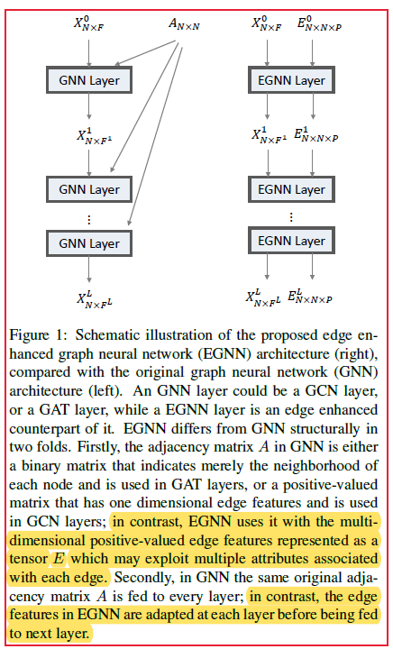

   > ​		其输入为  $X^0$  和  $E^0$。在通过第一层EGAT层传播后，$X^0$ 变成新的节点特征矩阵 $X^1 \in \mathbb R^{N \times F^1}$。同时边缘特征将自适应为 $E^1$ ，并保持维度不变， $E^1$ 将作为下一层边缘特征的输入。该步骤在接下来的每一层中重复。对于每一个隐藏层而言，非线性激活函数将被应用在节点特征 $X^l$ 。对于节点分类问题，softmax操作将应用于每一个节点嵌入 $X^L_{i \centerdot}$；对于图分类或者回归这里不提，详见论文。
   >
   > 注意：输入的边缘特征 $E^0$ 早已预先被归一化。

   

   * **边缘的双随机归一化**：a.避免由不断的乘积操作导致的输出特征规模增大；b.双随机矩阵在图的边缘去噪方面中具有优势。

     设置 $\hat E$ 为原始边缘特征，则归一化后的边缘特征 $E$ 计算为：
     $$
     \begin{aligned}
     \tilde{E}_{i j p} &=\frac{\hat{E}_{i j p}}{\sum_{k=1}^{N} \hat{E}_{i k p}} \\
     E_{i j p} &=\sum_{k=1}^{N} \frac{\tilde{E}_{i k p} \tilde{E}_{j k p}}{\sum_{v=1}^{N} \tilde{E}_{v k p}}
     \end{aligned}
     $$
     $E_{\centerdot \centerdot p}$ 为非负实矩阵，且每行每列和为1。
     $$
     \begin{aligned}
     E_{i j p} & \geq 0 \\
     \sum_{i=1}^{N} E_{i j p} &=\sum_{j=1}^{N} E_{i j p}=1
     \end{aligned}
     $$
     
* **EGNN(A): Attention based EGNN layer**
     $$
     X^{l}=\sigma\left[||_{p=1}^{P}\left(\alpha_{. . p}^{l}\left(X^{l-1}, E_{. . p}^{l-1}\right) g^{l}\left(X^{l-1}\right)\right)\right]
     $$
   
  $$
     g^{l}\left(X^{l-1}\right)=W^{l} X^{l-1} \tag{1}
  $$
  
  ​		其中 $\sigma$ 是非线性激活函数，$\alpha$ 是生成维度为 $N \times N \times P$ 张量的函数，也被叫做注意力系数。不同通道（channels）的结果将通过连接操作（concatenate）合并。$\alpha$计算如下：
  $$
     \begin{aligned}
     \alpha_{\cdot\cdot p}^{l} &=\operatorname{DS}\left(\hat{\alpha}_{\cdot \cdot p}^{l}\right) \\
     \hat{\alpha}_{i j p}^{l} &=f^{l}\left(X_{i \cdot}^{l-1}, X_{j\cdot}^{l-1}\right) E_{i j p}^{l-1}
     \end{aligned}
  $$
     ​		其中 $\mathrm {DS}$ 是双随机归一化操作。
  $$
     f^{l}\left(X_{i \cdot}^{l-1}, X_{j \cdot}^{l-1}\right)=\exp \left\{\mathrm{L}\left(a^{T}\left[W X_{i \cdot}^{l-1} \| W X_{j \cdot}^{l-1}\right]\right)\right\}
  $$
     ​		其中 $\mathrm L$ 是 $\mathrm {LeakyReLU}$ 激活函数；$W$ 是与公式（1）相同的映射；$||$ 是concatenate操作。注意力系数将被用作下一层新的边缘特征，即 $E$ 不断自适应而改变，则有：
  $$
     E^{l}=\alpha^{l}
  $$
  
   * **EGNN(C): Convolution based EGNN layer**
  $$
     X^{l}=\sigma\left[{||}_{p=1}^{p}\left(E_{. . p} X^{l-1} W^{l}\right)\right]
  $$
     ​	其中，$||$ 是concatenate操作，不同channels的结果将通过concatenate操作合并。$E$ 不变（个人理解）。
  
     

   * **Edge features for directed graph**：该模型将一个有向边channel $E_{ijp}$ 编码为：
  $$
     \left[\begin{array}{lll}
     E_{i j p} & E_{j i p} & E_{i j p}+E_{j i p}
     \end{array}\right]
  $$
     ​		每一个有向通道将被增大到三个通道。这三个通道定义三种邻居类型：前向、后向和无向。
  
     

7. **实验结果**

* **引文网络**

  * 数据集：Cora、CiteSeer、Pubmed

  * 节点特征：对于Cora和CiteSeer而言，节点特征包含01二元指标，表示关键词在论文中是否出现；对于Pubmed，ITF-IDF特征被用来描述网络节点。

  * 边缘特征：论文间的引用关系视为节点间的边，并将有向边编码成三维边缘特征向量。就我理解，该三维边缘特征向量指的是引用关系的【前向 后向 无向】。

    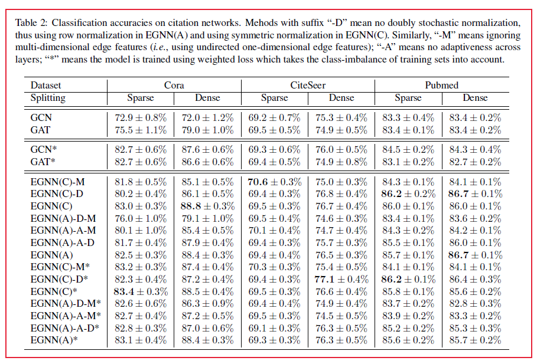

  > 1. “Sparse”：5%, 15% and 80% sized subsets for training, validation and test, respectively；“Dense”：60%, 20% and 20% sized subsets.
  >
  > 2. 在所有实验中使用两层EGNN模型。
  >
  > 3. 数据集的类别分布不平衡。为了测试数据集不平衡性的效果，作者采用两种不同的损失函数训练每个算法：不带权重的损失和带权重的损失。节点属于类别 $k$ 的权重被计算为：
  >    $$
  >    \frac{\sum_{k=1}^{K} n_{k}}{K n_{k}}
  >    $$
  >    ​		其中 $K$ 和 $n_k$ 表示类别数量和在训练集中属于类别 $k$ 的节点数量。

* 分子分析 （不提 详见论文）

### 6. Composition-based Multi-Relational Graph Convolutional Networks

1. **出版**：ICLR 2020

2. **源码**：[https://github.com/malllabiisc/CompGCN](https://github.com/malllabiisc/CompGCN)

3. **类型**：多关系图；有向图

4. **目的**：研究多关系图上的图表示学习，实现节点和关系同时嵌入，并解决传统多关系图模型中随着关系数的增多而导致的参数过载问题。

5. **贡献**：

   * COMPGCN模型利用知识图谱嵌入技术中的各种组合操作，实现图卷积神经网络上的多关系信息合并，以及节点和关系的共同嵌入；
   * COMPGCN模型可推广其他已有的多关系GCN方法，并且可根据关系数量进行缩放调整；
   * 在节点分类、链接预测以及图分类任务中，COMPGCN模型具有有效性。

6. **思想**：

   ​		构建多关系图$\mathcal{G}=(\mathcal{V}, \mathcal{R}, \mathcal{E}, \mathcal{X}, \mathcal{Z})$，其中 $\mathcal{V}$ 和 $\mathcal E$ 分别表示节点集合和边集合，$\mathcal{X} \in \mathbb{R}^{|\mathcal{V}| \times d_{0}}$ 和 $\mathcal{Z} \in \mathbb{R}^{|\mathcal{R}| \times d_{0}}$ 分别表示初始的节点特征和关系特征（注：节点和关系特征维度一致）。$\mathcal R$ 表示关系集合，每条边 $(u,v,r)$ 表示从节点 $u$ 到节点 $v$ 之间存在关系 $r \in \mathcal R$ 。该模型将原始的边 $\mathcal E$ 和关系 $\mathcal R$ 进行扩充，使其含有原始边、逆向边以及自环边。其中 $\top$ 表示自环，具体为：
   $$
   \left.\mathcal{E}^{\prime}=\mathcal{E} \cup\left\{\left(v, u, r^{-1}\right) \mid(u, v, r) \in \mathcal{E}\right\} \cup\{(u, u, \top) \mid u \in \mathcal{V})\right\}
   $$

   $$
   \mathcal{R}^{\prime}=\mathcal{R} \cup \mathcal{R}_{i n v} \cup\{\top\}
   $$

   ​		COMPGCN模型的结构如下：

   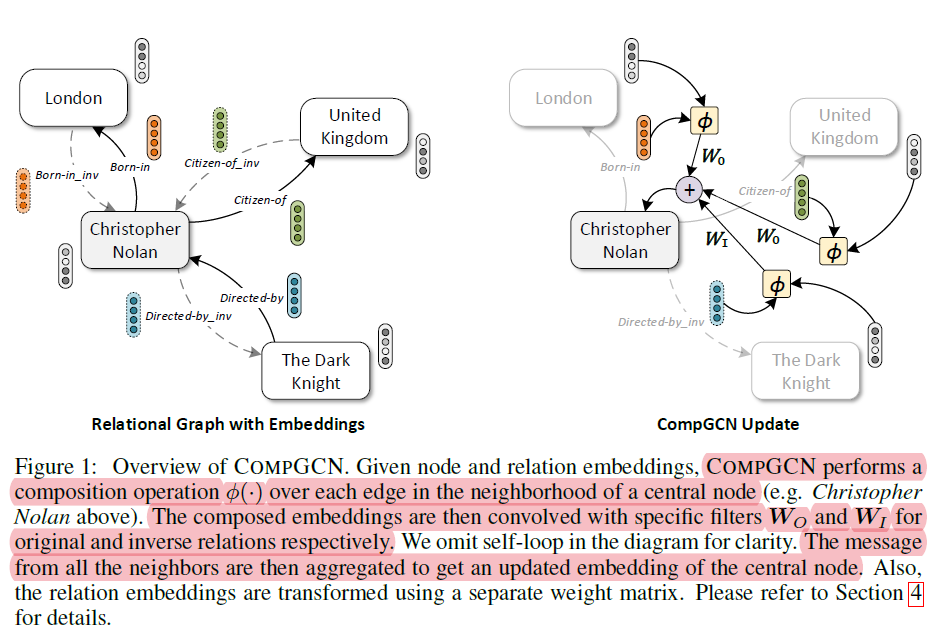

   ​	

   ​		COMPGCN模型同时学习 $d$ 维的关系嵌入 $\boldsymbol{h}_{r} \in \mathbb{R}^{d}$（$\forall r \in \mathcal{R}$）和节点嵌入  $\boldsymbol{h}_{v} \in \mathbb{R}^{d}$（$\forall v \in \mathcal{V}$）。$\boldsymbol{h}_{v}^{k+1}$ 表示 $k$ 层以后节点 $v$ 的向量表示，COMPGCN模型的更新公式如下：
   $$
   \boldsymbol{h}_{v}^{k+1}=f\left(\sum_{(u, r) \in \mathcal{N}(v)} \boldsymbol{W}_{\lambda(r)}^{k} \phi\left(\boldsymbol{h}_{u}^{k}, \boldsymbol{h}_{r}^{k}\right)\right)
   $$
   ​		其中，$\mathcal f$ 是激活函数，$\mathcal N(v)$ 表示节点 $v$ 向外的边所对应的邻节点集合，$\phi: \mathbb{R}^{d} \times \mathbb{R}^{d} \rightarrow \mathbb{R}^{d}$ 是组合操作（*composition*）。关于 $\phi$ 操作，论文给出三种策略：

   * **向量减 （Sub）**：$\phi\left(e_{s}, e_{r}\right)=e_{s}-e_{r}$；

   * **向量乘 （Mult）**：$\phi\left(e_{s}, e_{r}\right)=e_{s}*e_{r}$；

   * **向量循环相关（[Corr](https://www.cnblogs.com/zhxuxu/p/10097620.html)）**：$\phi\left(e_{s}, e_{r}\right)=e_{s}\star e_{r}$；

     $\boldsymbol{W}_{\lambda(r)}$ 是关于关系类型的特定参数矩阵，设置$\lambda(r)=\operatorname{dir}(r)$，则有：

   $$
   \boldsymbol{W}_{\operatorname{dir}(r)}=\left\{\begin{array}{ll}
   \boldsymbol{W}_{O}, & r \in \mathcal{R} \\
   \boldsymbol{W}_{I}, & r \in \mathcal{R}_{i n v} \\
   \boldsymbol{W}_{S}, & r=\top(\text {self-loop})
   \end{array}\right.
   $$
   ​		同理，$\boldsymbol{h}_{r}^{k+1}$ 表示 $k$ 层以后关系 $r$ 的表示，则有
   $$
   \boldsymbol{h}_{r}^{k+1}=\boldsymbol{W}_{\mathrm{rel}}^{k} \boldsymbol{h}_{r}^{k}
   $$
   ​		其中，$\boldsymbol{W}_{\mathrm{rel}}$ 是可训练的转换矩阵，将所有关系投影到和节点相同的嵌入空间中，即维度和节点特征保持一致。$\boldsymbol{h}_{v}^{0}$ 和 $\boldsymbol{h}_{r}^{0}$ 是初始的节点特征（$x_v$）和关系特征（$z_r$）。

   ​		COMPGCN模型定义每种关系的嵌入表示为一组基向量的线性组合，而不是为其单独定义嵌入表示。设置 $\left\{\boldsymbol{v}_{1}, \boldsymbol{v}_{2}, \ldots, \boldsymbol{v}_{\mathcal{B}}\right\}$ 为一组可训练的基向量集合，初始关系表示将被定义为：
   $$
   \boldsymbol{z}_{r}=\sum_{b=1}^{\mathcal{B}} \alpha_{b r} \boldsymbol{v}_{b}
   $$
   ​		其中 $\alpha \in \mathbb R$ 为可训练的标量权重。该模型只为第一层定义基向量。

7. **实验结果**

   * **链接预测**

     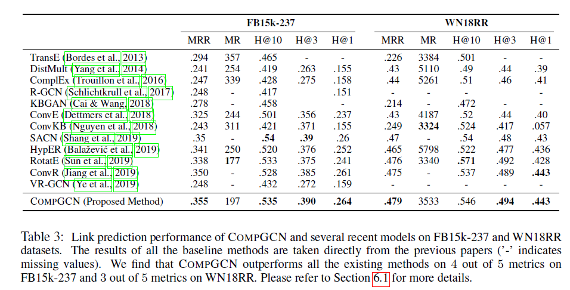

     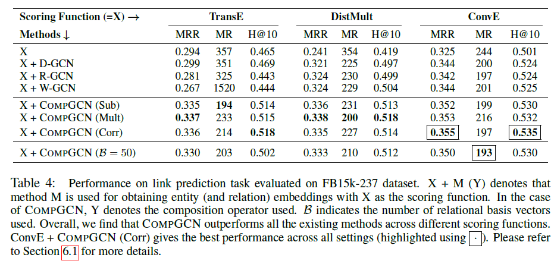

   * **节点分类和图分类**

     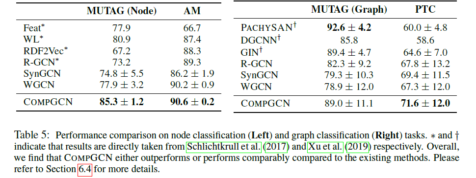

###  7. GRAPH-BERT : Only Attention is Needed for Learning Graph Representations

1. **出版**：ArXiv
2. **源码**：[https://github.com/jwzhanggy/Graph-Bert](https://github.com/jwzhanggy/Graph-Bert)
3. **目的**：传统的图表示学习模型大多基于图结构（the links among the nodes），并通过聚合邻居信息或卷积操作保留图结构的信息。然而，这些方法往往会导致假死问题和过平滑问题。这些问题妨碍了GNNs模型在深层图表示学习任务中的应用。同时内在的相互连接性质排除了图的并行化，而并行化对于大型图而言十分关键，因为内存约束限制了节点的批量处理。Graph-bert模型能够缓解上述问题。
4. **贡献**

* **New GNN model**：Graph-bert模型并不依赖图中节点的连接（graph links），并能有效解决假死问题。同时对于采样后的无边子图（target node with context），该模型也是可训练的。

- **Unsupervised Pre-Training**：给定一个无标签的输入图，该模型可通过node attribute reconstruction和graph structure recovery两个任务进行预训练。
- **Fine-Tuning and Transfer**：根据特定下游任务的需求（如节点分类或节点聚合任务），预训练后的Graph-bert模型可作进一步的微调。同时预训练后的graph-bert模型还可被迁移并应用在其他序列模型上。

5. **思想**：Graph-bert模型仅仅基于注意力机制，而没采用任何图卷积或聚合操作。同时不再使用完整的、庞大的输入图进行训练，而是利用采样后的无边子图（包含目标节点和局部上下文信息）训练Graph-bert模型。该模型的训练过程涉及几个部分：(1) linkless subgraph batching (2) node input embedding (3) graph-transformer based encoder  (4) representation fusion (5) the functional component

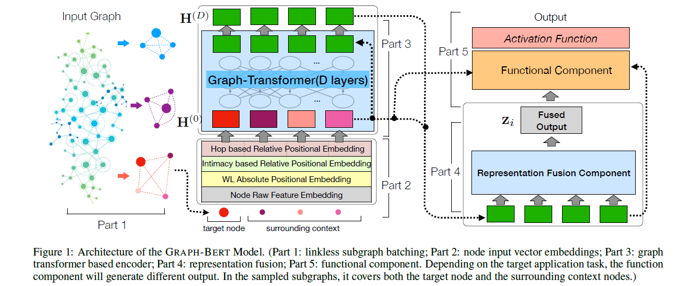

* **Linkless Subgraph Batching**

  ​		为了控制采样过程中的随机性，该论文采用 *top-k intimacy* 采样方法。该采样方法是基于图的关联矩阵 $\mathbf{S} \in \mathbb{R}^{|\mathcal{V}| \times|\mathcal{V}|}$ ，其中 $\mathbf S(i,j)$ 表示节点 $v_i$ 和 $v_j$ 间的关联度分数。该模型根据页面排名（PageRank）算法定义矩阵 $\mathbf S$ ，公式如下：
  $$
  \mathbf{S}=\alpha \cdot(\mathbf{I}-(1-\alpha) \cdot \overline{\mathbf{A}})^{-1}
  $$
  ​		其中，$\alpha \in [0,1]$（通常被设置为0.15）。$\overline{\mathbf{A}}=\mathbf{A} \mathbf{D}^{-1}$表示列标准化的邻接矩阵。

  ​		$\Gamma(v_i)$表示目标节点$v_i$的“上下文”节点，包含了在输入图中关于 $v_i$ 的前 $k$ 个关联节点（即在排序后的$\mathbf S(i,:)$中挑出前k个大的值所对应的节点（不包含本身））。将输入图转换为所有节点采样后的子图集合$\mathcal{G}=\left\{g_{1}, g_{2}, \cdots, g_{|\mathcal{V}|}\right\}$，其中$g_{i}=\left(\mathcal{V}_{i}, \varnothing\right)$表示目标节点$v_i$采样后的无边子图，$\mathcal{V}_{i}=\left\{v_{i}\right\} \cup \Gamma\left(v_{i}\right)$表示包含目标节点$v_i$和其上下文节点。

* **Node Input Vector Embeddings**

  ​		根据关联度分数从大到小排序，将子图节点放入有序的节点列表中$\left[\begin{array}{lll}v_{i}, v_{i,1}, \cdots, & v_{i,k}\end{array}\right]$。输入向量嵌入实际上包含四个部分：(1) raw feature vector embedding  (2) Weisfeiler-Lehman absolute role embedding (3) intimacy based relative positional embedding  (4) hop based relative distance embedding

  * **Raw Feature Vector Embedding**

    ​		对于子图 $g_i$ 中的每个节点 $v_j$ 而言，该模型将其原始的特征向量嵌入到一个共享空间中。
    $$
    \mathbf{e}_{j}^{(x)}=\operatorname{Embed}\left(\mathbf{x}_{j}\right) \in \mathbb{R}^{d_{h} \times 1}
    $$
    ​		其中$\text Embed()$方法可由不同模型进行定义。For instance,CNN can be used if $\mathbf x_j$ denotes images; LSTM/BERT can be applied if $\mathbf x_j$ denotes texts; and simple fully connected layers can also be used for simple attribute inputs.

    

  * **Weisfeiler-Lehman Absolute Role Embedding**

    ​		Weisfeiler-Lehman ($\mathrm{WL}$) 算法 [[Niepert et al., 2016](https://arxiv.org/abs/1605.05273)]可以根据节点在图中的结构位置标记节点，并且具有相同结构位置的节点将会获得相同标记。对于子图中的节点$v_{j} \in \mathcal{V}_{i}$，本文定义其$\mathrm{WL}$ 代码为$\mathrm{WL}\left(v_{j}\right) \in \mathrm{N}$。$\mathrm{WL}\left(v_{j}\right)$是基于完整的输入图预先计算好的，并在不同的采样后的子图中它是不变的。本文采用[[Vaswani et al., 2017](https://arxiv.org/abs/1706.03762)]提出的嵌入方法并定义节点$\mathrm{WL}$ absolute role embedding vector为：
    $$
    \begin{aligned}
    \mathbf{e}_{j}^{(r)} &=\text { Position-Embed }\left(\mathrm{WL}\left(v_{j}\right)\right) \\
    &=\left[\sin \left(\frac{\mathrm{WL}\left(v_{j}\right)}{10000^{\frac{2 l}{d_{h}}}}\right), \cos \left(\frac{\mathrm{WL}\left(v_{j}\right)}{10000^{\frac{2 l+1}{d_{h}}}}\right)\right]_{l=0}^{\left\lfloor\frac{d_{h}}{2}\right\rfloor} \in  \mathbb{R}^{d_{h} \times 1}
    \end{aligned}
    $$
    可捕获全局节点角色（位置）信息。

    

  * **Intimacy based Relative Positional Embedding**		

    ​		该部分引入相对位置嵌入。基于有序的节点列表$\left[\begin{array}{lll}v_{i}, v_{i,1}, \cdots, & v_{i,k}\end{array}\right]$，根据节点对应的位置可提取子图中的局部信息。$\mathbf P(v_j)$表示节点$v_{j} \in \mathcal{V}_{i}$的索引位置，默认$\mathbf P(v_i)=0$，并且离 $v_i$ 越近的节点将获得更小的位置索引 。$\mathbf P()$ 可变，对于相同的节点 $v_j$ 而言，不同的子图中 $\mathbf P(v_j)$ 不同。其公式（与[[Vaswani et al., 2017](https://arxiv.org/abs/1706.03762)]类似）如下：

  $$
  \mathbf{e}_{j}^{(p)}=\text { Position-Embed }\left(\mathrm{P}\left(v_{j}\right)\right) \in \mathbb{R}^{d_{h} \times 1}
  $$

  

  * **Hop based Relative Distance Embedding**

      		对于子图 $g_i$ 中的节点$v_{j} \in \mathcal{V}_{i}$，该部分将其在最初的输入图中与节点 $v_i$ 的相对距离表示为$\mathbf H(v_j;v_i)$，定义其嵌入向量（与[[Vaswani et al., 2017](https://arxiv.org/abs/1706.03762)]类似）为：
    $$
    \mathbf{e}_{j}^{(d)}=\text { Position-Embed }\left(\mathrm{H}\left(v_{j} ; v_{i}\right)\right) \in \mathbb{R}^{d_{h} \times 1}
    $$
    ​		其中，在不同子图中，对于相同节点 $v_j$ 而言，$\mathbf{e}_{j}^{(d)}$ 可变。

    

* **Graph Transformer based Encoder**

  定义节点$v_{j} \in \mathcal{V}_{i}$的初始输入向量为：

$$
\mathbf{h}_{j}^{(0)}=\text { Aggregate }\left(\mathbf{e}_{j}^{(x)}, \mathbf{e}_{j}^{(r)}, \mathbf{e}_{j}^{(p)}, \mathbf{e}_{j}^{(d)}\right)
$$

​		其中，在本文中聚合函数使用向量相加（vector summation）。最终子图 $g_i$ 中所有节点的初始输入向量将被组合成输入矩阵$\mathbf H^{(0)}=\left[\mathbf{h}_{i}^{(0)}, \mathbf{h}_{i, 1}^{(0)}, \cdots, \mathbf{h}_{i, k}^{(0)}\right]^{\top} \in \mathbb{R}^{(k+1) \times d_{h}}$。基于graph transformer的编码器将通过 $D$ 层迭代不断更新节点表示，其 $l$-th 层的输出表示为：
$$
\begin{aligned}
\mathbf{H}^{(l)} &=\text { G-Transformer }\left(\mathbf{H}^{(l-1)}\right) \\
&=\operatorname{softmax}\left(\frac{\mathrm{Q} \mathrm{K}^{\top}}{\sqrt{d_{h}}}\right) \mathrm{V}+\text {G-Res}\left(\mathrm{H}^{(l-1)}, \mathrm{X}_{i}\right)
\end{aligned}
$$
​		其中
$$
\left\{\begin{aligned}
\mathbf{Q} &=\mathbf{H}^{(l-1)} \mathbf{W}_{Q}^{(l)} \\
\mathbf{K} &=\mathbf{H}^{(l-1)} \mathbf{W}_{K}^{(l)} \\
\mathbf{V} &=\mathbf{H}^{(l-1)} \mathbf{W}_{V}^{(l)}
\end{aligned}\right.
$$
​		在上述等式中，$\mathbf{W}_{Q}^{(l)}, \mathbf{W}_{K}^{(l)}, \mathbf{W}_{K}^{(l)} \in \mathbb{R}^{d_{h} \times d_{h}}$表示相关的变量，$\text {G-Res}\left(\mathrm{H}^{(l-1)}, \mathrm{X}_{i}\right)$表示由[[Zhang and Meng，2019](https://arxiv.org/abs/1909.05729v1)]提出的图残差项。$\mathbf{X}_{i} \in \mathbb{R}^{(k+1) \times d_{x}}$表示子图 $g_i$ 中所有节点的原始特征。

​	

*  **representation fusion**

$$
\left\{\begin{array}{l}
\mathbf{H}^{(0)}=\left[\mathbf{h}_{i}^{(0)}, \mathbf{h}_{i, 1}^{(0)}, \cdots, \mathbf{h}_{i, k}^{(0)}\right]^{\top} \\
\mathbf{H}^{(l)}=\text { G-Transformer }\left(\mathbf{H}^{(l-1)}\right), \forall l \in\{1,2, \cdots, D\} \\
\mathbf{z}_{i}=\text { Fusion }\left(\mathbf{H}^{(D)}\right) \in \mathbb R^{d_h \times 1}
\end{array}\right.
$$

​		本文中，$\text {Fusion}()$方法将对输入列表中的所有节点表示取平均，并将其表示为目标节点 $v_i$ 的最终状态。向量 $\mathbf z_i$ 和矩阵 $\mathbf H^{(D)}$ 均会被输出到graph-bert模型中的functional component部分。根据不同的应用任务，functional component和学习目标（如loss function）是不同的。

* **Graph-bert 学习过程**

  * 预训练

    （1）**Node Raw Attribute Reconstruction**

    ​		通过全连接层（如果必要将加入激活函数），本文将节点 $v_i$ 重构后的原始特征表示为$\hat{\mathbf{x}}_{i}=\mathrm{FC}\left(\mathbf{z}_{i}\right)$。其loss function为：
    $$
    \ell_{1}=\frac{1}{|\mathcal{V}|} \sum_{v_{i} \in \mathcal{V}}\left\|\mathbf{x}_{i}-\hat{\mathbf{x}}_{i}\right\|_{2}
    $$
    ​		其中 $\mathbf L_p$ 范数的定义为$\|\mathbf{x}\|_{p}=\left(\sum_{i}|\mathbf{x}(i)|^{p}\right)^{\frac{1}{p}}$

    （2）**Graph Structure Recovery**

    ​		通过计算节点 $v_i$ 和 $v_j$ 的余弦相似度以表示它们之间推断连接的分数$\hat{\boldsymbol{s}}_{i, j}=\frac{\mathbf{z}_{i} \mathbf{z}_{j}}{\left\|\mathbf{z}_{i}\right\|\left\|\mathbf{z}_{j}\right\|}$，其loss function为：

  $$
  \ell_{2}=\frac{1}{|\mathcal{V}|^{2}}\|\mathbf{S}-\hat{\mathbf{S}}\|_{F}^{2}
  $$

  ​				其中$\hat{\mathbf{S}} \in \mathbb{R}^{|\mathcal{V}| \times |\mathcal{V}|}$ ， $\mathbf{S}(i, j)=\hat{\boldsymbol{s}}_{i, j}$，Frobenius范数的定义为$\|\mathbf{X}\|_{F}=\left(\sum_{i, j}|\mathbf{X}(i, j)|^{2}\right)^{\frac{1}{2}}$。

  

  * 模型迁移和微调

    （1）**Node Classification**

    ​		基于学习到的节点表示 $\mathbf z_i$ ，可将推断出的节点标签表示为$\hat{\mathbf{y}}_{i}=\operatorname{softmax}\left(\mathrm{FC}\left(\mathrm{z}_{i}\right)\right)$。在训练批次 $\mathcal{T}$ 中，其loss function为：
    $$
    \ell_{n c}=\sum_{v_{i} \in \mathcal{T}} \sum_{m=1}^{d_{y}}-\mathbf{y}_{i}(m) \log \hat{\mathbf{y}}_{i}(m)
    $$
    ​		通过加载预训练好的graph-bert模型，重新训练这些堆叠的全连接层，能够推断出节点的类标签。

    （2）**Graph Clustering**

    ​		对于每个目标簇$\mathcal{C}_{j} \in \mathcal{C}$而言，其中心表示为$\boldsymbol{u}_{j}=\sum_{v_{i} \in \mathcal{C}_{i}} \mathbf{Z}_{i} \in \mathbb{R}^{d_h}$。其目标函数（类似于 K-means）为
    $$
    \min _{\boldsymbol{\mu}_{1}, \cdots, \boldsymbol{\mu}_{l}} \min _{\mathcal{C}} \sum_{j=1}^{l} \sum_{v_{i} \in \mathcal{C}_{j}}\left\|\mathbf{z}_{i}-\boldsymbol{\mu}_{j}\right\|_{2}
    $$
    ​		训练过程中采用EM算法比误差反向传播算法更有效率。无需再训练，仅需将学习到的节点表示 $\mathbf z_i$ 作为图聚类模型中的节点输入特征即可。

    ​			

6. **实验结果**（部分）

* 残差项分析

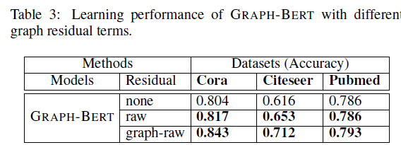

​	GRAPH-BERT with graph-raw residual term can outperform the other two.

* 初始嵌入分析（$\mathbf H^{(0)}$）

  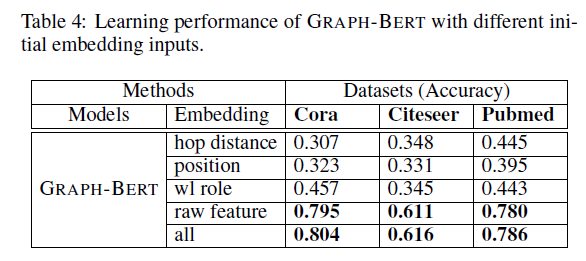

* 预训练 VS 不预训练

  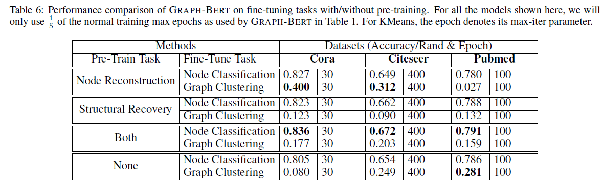

  ​		For most of the datasets, pretraining do give GRAPH-BERT a good initial state, which helps the model achieve better performance with only a very small number of fine-tuning epochs.

###  8. Graph U-nets

1. **出版**：ICML 2019

2. **源码**：[https://github.com/HongyangGao/Graph-U-Nets](https://github.com/HongyangGao/Graph-U-Nets)

3. **目的**：利用图池化（pooling）和上采样（up-sampling）解决节点分类和图分类任务。
4. **思想**：基于gPool和gUnpool层，作者提出一个作用于图上的编码器-解码器模型U-Nets。gPool层可根据节点在可训练的投影向量上的标量投影值，自适应地挑选重要节点组成更小的图；gUnpool层可以根据gPool层选择的节点的位置信息将图恢复到其原始结构。

* **gPool层**：根据节点在投影向量 $P$ 上的投影值，选择一些重要的节点组成新的更小的图。其中${{X}^{\ell }}\in {{\mathbb{R}}^{N\times C}}$是特征矩阵，${{A}^{\ell }}\in {{\mathbb{R}}^{N\times N}}$是邻接矩阵，$P$ 是可训练的投影向量，$k$ 是新图的节点数。${\odot}$ 表示元素级的矩阵乘法，$1_c$ 表示大小为 $C$ 且元素均为1的向量。

$$
\begin{align}
  & \mathbf{y}={{X}^{\ell }}{{\mathbf{p}}^{\ell }}/\left\| {{\mathbf{p}}^{\ell }} \right\| \\ 
 & \text{idx}=\operatorname{rank}(\mathbf{y},k) \\ 
 & \widetilde{\mathbf{y}}=\operatorname{sigmoid}(\mathbf{y}(\text{idx})) \\ 
 & {{{\tilde{X}}}^{\ell }}={{X}^{\ell }}(\text{idx},\ :) \\ 
 & {{A}^{\ell +1}}={{A}^{\ell }}(\text{idx},\text{idx}) \\ 
 & {{X}^{\ell +1}}={{{\tilde{X}}}^{\ell }}\odot \left( \widetilde{\mathbf{y}}\mathbf{1}_{C}^{T} \right)  
\end{align}
$$

​		其中，由于可能存在孤立点，所以为了增强图的连通性，设置如下：
$$
{{A}^{2}}={{A}^{\ell }}{{A}^{\ell }},\ \ \ {{A}^{\ell +1}}={{A}^{2}}(\text{idx},\text{idx})
$$

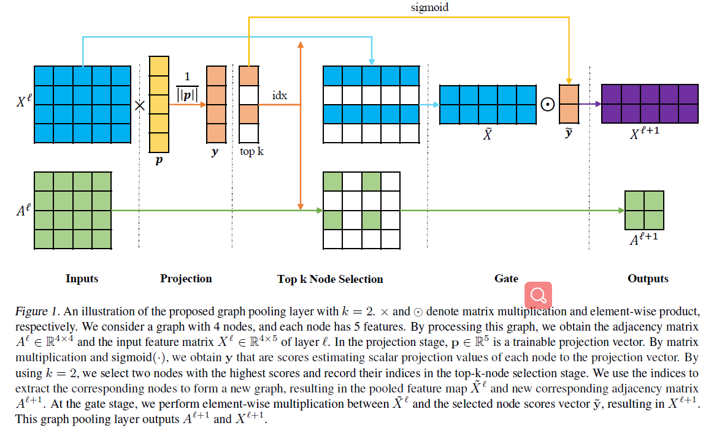

* **gUnpool层**：根据gPool层上节点的位置信息将图恢复到原始结构，即gPool层的逆操作。${{X}^{\ell }}\in {{\mathbb{R}}^{k\times C}}$是当前图的特征矩阵，$0_{N\times C}$是关于新图初始的空矩阵，$\mathrm {idx}$ 对应的是gPool层挑选的节点索引。$\operatorname{distribute}(\centerdot)$是根据储存的 $\mathrm {idx}$ 索引，将 ${{X}^{\ell }}$ 中的行向量分配到 $0_{N\times C}$中。即在 ${X}^{\ell +1}$ 中，与 $\mathrm {idx}$ 对应的行向量将被更新，其余仍然保持为0。

$$
{{X}^{\ell +1}}=\operatorname{distribute}\left( {{0}_{N\times C}},{{X}^{\ell }},\text{ idx } \right)
$$

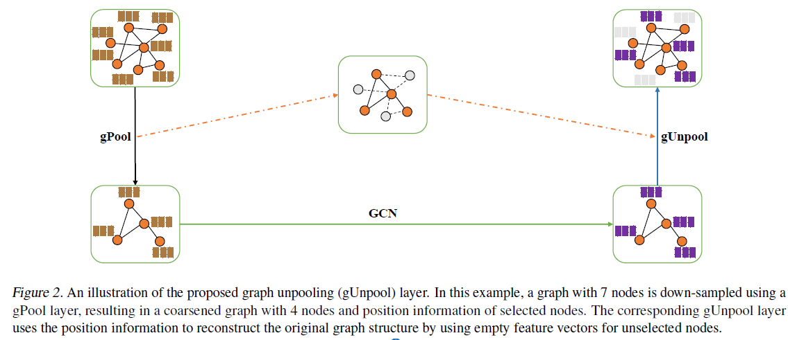

* **g-U-Nets**

  * Step1：构建嵌入层，将节点特征转为低维表示。实验采用一层GCN模型，并给予节点自身特征更高的权重$\hat{A}=A+2I$；

  $$
  {{X}_{\ell+1}}=\sigma\left({{{\hat{D}}}^{-\frac{1}{2}}}\hat{A}{{{\hat{D}}}^{-\frac{1}{2}}}{{X}_{\ell }}{{W}_{\ell }} \right)
  $$

  * Step2：通过堆叠编码块构建编码器，每个编码块包含一个gPool层和一个GCN层；
  * Step3：通过堆叠与编码块数量相同的解码块，每个解码块包含一个gUnpool层和一个GCN层；
  * Step4：应用一层GCN，并放入softmax分类器中。

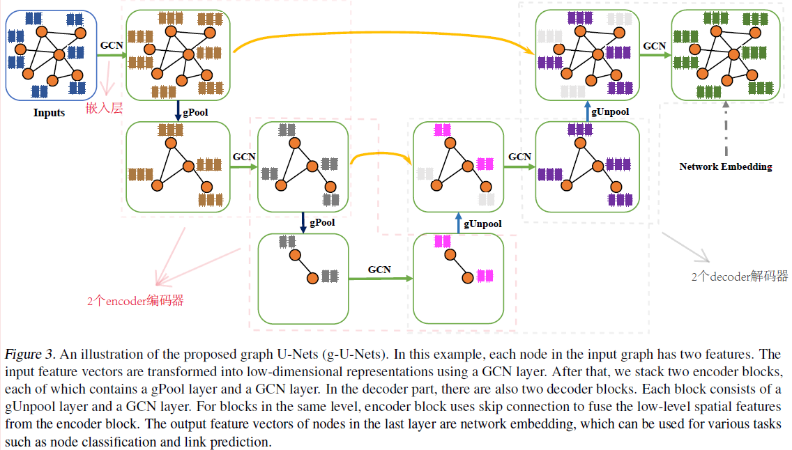

5. **实验结果**

* **性能研究**

  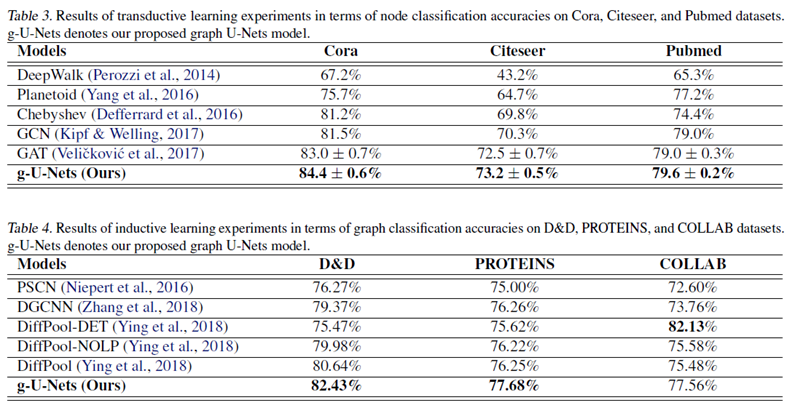

* **gPool和gUnpool层消融实验**

  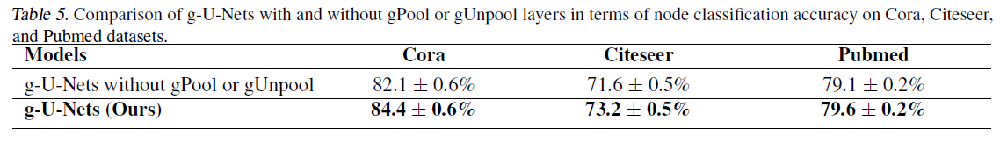

  表5展示了gPool和gUnpool层对g-U-Nets的贡献。相较于没有gPool和gUnpool的结构，g-U-Nets具有更好的性能。

  

* **图的连通性增强分析**

  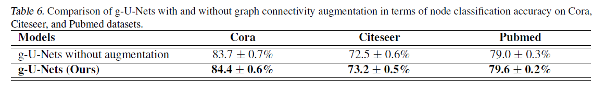

  表6显示了如果图的连通性不提升，则会造成所有数据集一致地性能退化。其表明通过图的2次幂增强图的连通性能够帮助改善图的连通性以及节点间的信息传播。

  

* **g-U-Nets网络深度研究**

  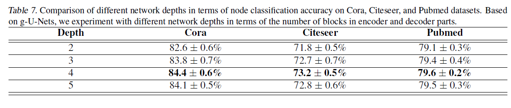

  随着网络加深至4层，性能逐渐提升。当深度继续加深，则导致过拟合问题，阻止网络性能提升。

  

* **图池化层的参数研究**

  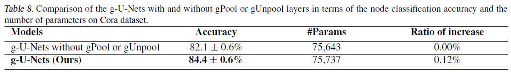

  增加少量的额外参数不会增大过拟合的风险。

### 9. Hierarchical Graph Representation Learning with Differentiable Pooling

1. **出版**：NIPS 2018
2. **源码**：[https://github.com/RexYing/diffpool](https://github.com/RexYing/diffpool)
3. **目的**：利用图池化解决图分类任务。
4. **贡献**

* 原始GNN结构仅通过边传播节点信息，而diffPool实现了对图的层级表示，以层级方式推断和聚合信息。
* diffPool学习可微分的软分配算法，以解决GNN模型（相比CNN）不具有空间局部性以及图数据的节点与边数量不定的挑战。

5. **思想**：作者提出可微分的图池化模块diffPool。其通过学习可微分的软分配算法，将每层GNN模型中的所有节点映射到一组簇中，并作为下一层GNN模型的粗化输入，以解决图分类任务。

* **概念**：一张图表示为 $G(A,F)$，其中 $A$ 为邻接矩阵，$F$ 为节点特征矩阵。实验任务是给定一组带标签的图数据 $\mathcal{D}=\left\{ \left( {{G}_{1}},{{y}_{1}} \right),\left( {{G}_{2}},{{y}_{2}} \right),\ldots \right\}$（其中 $y$ 表示标签），通过学习映射算法 $f:\mathcal{G}\to \mathcal{Y}$ 将图映射到标签中，以解决图分类任务。

* **原理**

  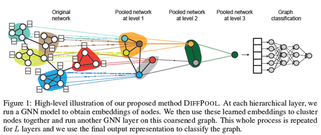

  * 图嵌入：构建图神经网络以学习图嵌入，其中 ${{W}^{(k)}}$ 是可训练的参数矩阵，${{H}^{(k)}}$ 表示第 $k$ 层的节点嵌入，$M$ 是信息传播函数（以GCN为例）。

  $$
  {{H}^{(k)}}=M\left( A,{{H}^{(k-1)}};{{W}^{(k)}} \right)=\operatorname{ReLU}\left( {{{\tilde{D}}}^{-\frac{1}{2}}}\tilde{A}{{{\tilde{D}}}^{-\frac{1}{2}}}{{H}^{(k-1)}}{{W}^{(k-1)}} \right)
  $$

  * 图池化：通过学习软分配策略，将所有节点进行簇分配，并输出一张新的粗化图，可作为另一个GNN层的输入。经过图池化处理后节点(簇)特征矩阵以及邻接矩阵如下：

  $$
  \begin{align}
    & {{X}^{(l+1)}}={{S}^{{{(l)}^{T}}}}{{Z}^{(l)}}\in {{\mathbb{R}}^{{{n}_{l+1}}\times d}} \\ 
   & {{A}^{(l+1)}}={{S}^{{{(l)}^{T}}}}{{A}^{(l)}}{{S}^{(l)}}\in {{\mathbb{R}}^{{{n}_{l+1}}\times {{n}_{l+1}}}} \\ 
  \end{align}
  $$

  ​		其中簇分配矩阵 ${{S}^{(l)}}\in {{\mathbb{R}}^{{{n}_{l}}\times {{n}_{l\text{+1}}}}}$ 以及节点嵌入矩阵 ${{Z}^{(l)}}$ 的计算公式如下：
  $$
  {{Z}^{(l)}}=\text{GN}{{\text{N}}_{l,\text{embed}}}\left( {{A}^{(l)}},{{X}^{(l)}} \right)
  $$

  $$
  {{S}^{(l)}}=\operatorname{softmax}\left( \text{GN}{{\text{N}}_{l,\text{pool}}}\left( {{A}^{(l)}},{{X}^{(l)}} \right) \right)
  $$

  > 注意：两个GNN具有相同的输入数据，但参数不同，并且可采用不同GNN模型。最后一层所有节点将被分配到一个簇中，生成一个最终的嵌入向量，并进行全连接放入分类器中，采用梯度下降进行端到端的训练。

6. **实验结果**

* 图分类结果

  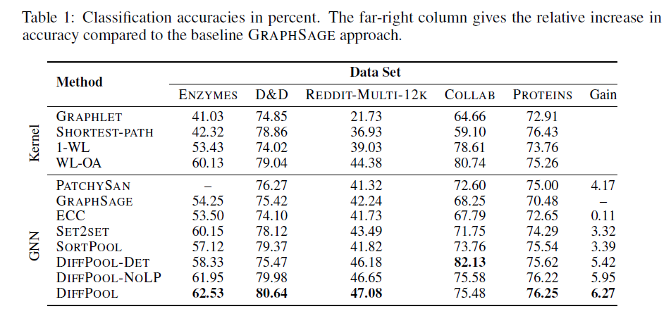

  ​		DIFFPOOL方法在所有GNN池化方法中具有最高的平均性能，在基于Graphsage结构中平均提高6.27%，在4/5的基准数据集中取得最佳效果。简化变体版本DIFFPOOL-DET在COLLAB数据集中效果最好。

  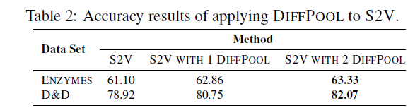

  ​		DIFFPOOL策略提高了S2V模型的性能，并且可应用于不同的GNN结构进行层级池化。尽管DIFFPOOL需要额外计算分配矩阵，但在实践中并没有带来大量额外的运行时间。

### 10. Hypergraph Neural Networks

1. **出版**：AAAI 2019

2. **源码**：[https://github.com/iMoonLab/HGNN](https://github.com/iMoonLab/HGNN)

3. **类型**：无向超图，即一条边连接多个节点

4. **目的**：研究超图结构上高阶的数据关联性；处理多模态数据；缓解传统的超图学习方法具有高计算复杂度以及存储损失的问题。

5. **贡献**：

   * **提出HGNN模型**：可用公式表示复杂的高阶数据关联性，并且利用超边卷积操作能有效地处理多模态数据或特征。GCN是HGNN的一个特例，即具有2阶超边的超图。
   * **HGNN模型的有效性**：在引文网络分类和视觉对象分类任务中具有有效性，同时在处理多模态数据时有更好的性能。

6. **思想**：传统图中，每条边的度均设置为2，即每条边仅连接2个节点。而超图通过使用其无限制“度”的超边编码高阶数据关联性（超越成对的连接），其利用灵活的超边易扩展成多模态、异质的数据表示。一个超图可以通过合并邻接矩阵，联合使用多模态数据来生成超图。

   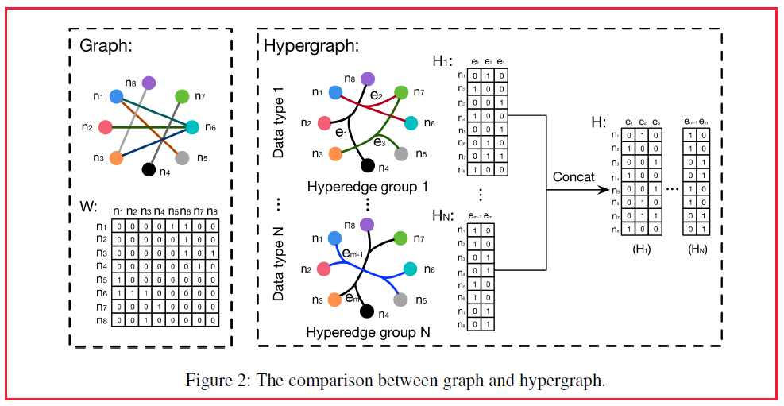

   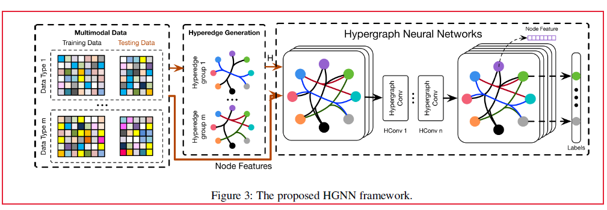

   ​		定义超图为 $\mathcal G = (\mathcal V,\mathcal E,\mathrm W)$ ，其中 $\mathcal V$ 为节点集合， $\mathcal E$ 为超边集合，每条超边被 $\mathrm W$ （对角边权矩阵）分配一个权重。用关联矩阵 $\mathrm H \in \mathbb R^{\mathcal {|V| \times |E|}}$ 表示超图 $\mathcal G$ ：
   $$
   h(v, e)=\left\{\begin{array}{ll}
   1, & \text { if } v \in e \\
   0, & \text { if } v \notin e
   \end{array}\right.
   $$
   ​		节点的度被定义为 $d(v)=\sum_{e \in \mathcal{E}} \omega(e) h(v, e)$ ，超边的度被定义为 $\delta(e)=\sum_{v \in \mathcal{V}} h(v, e)$。$\mathrm D_e$ 和 $\mathrm D_v$ 分别表示边和节点的度矩阵（均为对角矩阵）。

   ​		节点分类任务的目标函数为：
   $$
   \arg \min _{f}\left\{\mathcal{R}_{{emp}}(f)+\Omega(f)\right\}
   $$
   ​		其中，$\mathcal{R}_{{emp}}(f)$ 表示监督的经验损失（个人理解为交叉熵），$f(\cdot)$  表示分类函数（个人理解为前向传播函数）。$\Omega(f)$ 表示超图上的归一化处理，$\Delta = \mathrm I-\mathrm{D}_{v}^{-1 / 2} \mathrm{HWD}_{e}^{-1} \mathrm{H}^{\top} \mathrm{D}_{v}^{-1 / 2}$  ，则 $\Omega(f)$ 定义为 
   $$
   \Omega(f)=f^{\top} \Delta
   $$
   ​		HGNN模型卷积层公式为：
   $$
   \mathrm{X}^{(l+1)}=\sigma\left(\mathrm{D}_{v}^{-1 / 2} \mathrm{HWD}_{e}^{-1} \mathrm{H}^{\top} \mathrm{D}_{v}^{-1 / 2} \mathrm{X}^{(l)} \Theta^{(l)}\right)
   $$
   ​		其中，边权矩阵 $\mathrm W$ 为单位矩阵，即所有超边具有相同权重。卷积核 $\Theta$ 为可训练的参数矩阵。$\sigma$ 表示非线性激活函数，$\mathrm X^{(l)} \in \mathbb R^{N \times C}$ 表示 $l$ 层的节点表示，$\mathrm X^{(0)}=\mathrm X$。

   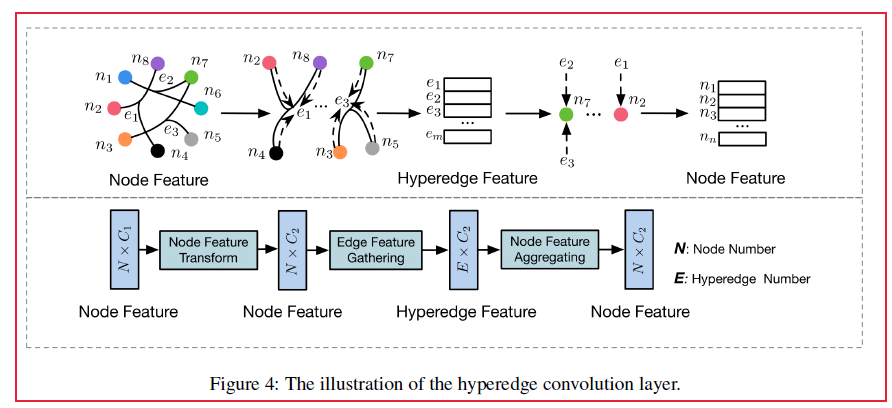

   

   > At first, the initial node feature $\mathrm X^{(1)}$ is processed by learnable filter matrix $\Theta^{(1)}$ to extract $\mathrm C_2$-dimensional feature. Then, then ode feature is gathered according to the hyperedge to form the hyperedge feature $\mathbb R^{E \times C_2}$ , which is implemented by the multiplication of  $\mathrm H^{\top} \in \mathbb R^{\mathrm E \times \mathrm N}$. Finally the output node feature is obtained by aggregating their related hyperedge feature, which is achieved by multiplying matrix $\mathrm H$.

7. **实验结果**

* **引文网络分类**

  * 数据集：Cora、Pumbed

    每个节点的特征都是文本的词袋表示；节点的连接表示引用关系。

  * 流程：

    * 构建超图：假设 $N$ 个数据，根据图上的邻接关系，用每条超边连接每个节点和其邻节点，即得到 $N$ 个超边以及 $\mathrm H \in \mathbb R^{\mathrm {N \times N}}$。
    * 建模：使用2层HGNN模型；softmax函数用来产生预测标签；在训练期间，交叉熵损失反向传播以更新参数。

  * 实验结果

    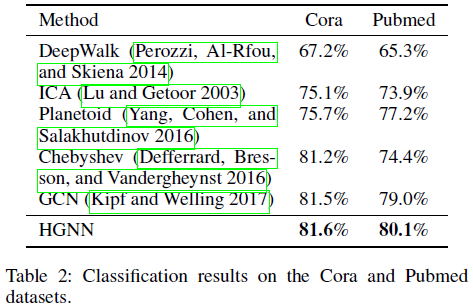

* **视觉对象分类**（详见论文）

### 11. HyperGCN: A new method of training graph convolutional networks on hypergraphs

1. **出版**：NIPS 2019

2. **源码**：[https://github.com/malllabiisc/HyperGCN](https://github.com/malllabiisc/HyperGCN)

3. **类型**：无向超图

4. **目的**：解决基于超图的半监督学习任务

5. **贡献**：

   * 我们提出了HyperGCN，利用超图的谱理论在超图上训练GCN，并介绍了其变体FastHyperGCN；
   * 在真实世界超图上解决了SSL和组合优化问题，且通过实验证明该算法比较高效。
   * 全面讨论了HyperGCN与HGNN的区别与优势。

6. **思想**：

   ​		HyperGCN的本质是将超图转为图，再利用图卷积操作解决问题。HGNN是利用连通分量拓展（clique expansion）拟合超边，即每条超边上的所有顶点均两两成对连接，则具有 $n$ 个顶点的超边拓展后有 $C^2_n$ 条边。而HyperGCN利用一组连接超边顶点的成对边来拟合超边，其拓展后的边与超边大小成线性关系$\mathcal O(n)$（2$n$-3）。

   **规则**：在同一条超边上的超节点是相似的，因此共享同种标签。在任何超边 $e$ 上，若 $\max _{i, j \in e}|| h_{i}-h_{j} \|^{2}$ 很小，则说明该超边上的所有超节点彼此接近。

   * **1-hyperGCN**（每条超边用一条成对边拟合）

     * 构建超图拉普拉斯矩阵（将超图转为图）

       ​		给定一个定义在超节点上的实值信号 $S \in \mathbb R^n$ （$n = |V|$ 为超节点数量），计算其超图拉普拉斯矩阵 $L(S)$

       1. 对于每条超边 $e \in E$，令 $(\left.i_{e}, j_{e}\right):=\operatorname{argmax}_{i, j \in e}\left|S_{i}-S_{j}\right|$ ，即 $(i_e,j_e)$ 表示在超边 $e$ 中距离最远的两个节点；
       2. 通过增加边 $\left\{\left\{i_e,j_e\right\}:e \in E\right\}$ 构建定义在顶点集 $V$ 的加权图 $G_S$ ，其边权为 $w\left(\left\{i_{e}, j_{c}\right\}\right):=w(e)$ （超边 $e$ 的权重）。令 $A_S$ 为简单图 $G_S$ 的加权邻接矩阵；
       3. 对称正则化的超图拉普拉斯矩阵：$L(S):=\left(I-D^{-\frac{1}{2}} A_{S} D^{-\frac{1}{2}}\right) S$

     * 卷积操作

     $$
     h_{v}^{(\tau+1)}=\sigma\left(\left(\Theta^{(\tau)}\right)^{T} \sum_{u \in \mathcal{N}(v)}\left(\left[\bar{A}_{S}^{(\tau)}\right]_{v, u} \cdot h_{u}^{(\tau)}\right)\right)
     $$

     ​		其中，$\tau$ 为epoch数，$\bar{A}_{S}$ 表示 $G_S$ 的正则化邻接矩阵。注意：邻接矩阵每次迭代时均被重新计算。

     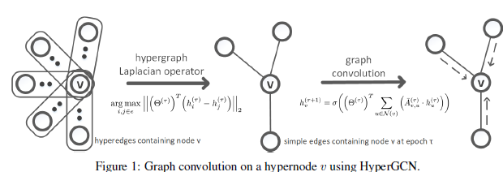

     > Figure 1 shows a hypernode $v$ with five hyperedges incident on it. We consider exactly one representative simple edge for each hyperedge $e \in E$ given by $(i_e,j_e)$ where $(i_e,j_e)= \text{argmax}_{i,j \in e} \left\|\left(\Theta^{(\tau)}\right)^{T}\left(h_{i}^{(\tau)}-h_{j}^{(\tau)}\right)\right\|_{2}$ for epoch $\tau$ . Because of this consideration, the hypernode $v$ may not be a part of all representative simple edges (only three shown in figure). We then use traditional Graph Convolution Operation on $v$ considering only the simple edges incident on it. Note that we apply the operation on each hypernode $v \in V$ in each epoch $\tau$ of training until convergence.

     **总结**：只连接距离最远的两个核心点，同一个超边中的其他点都直接丢弃（也就是drop edge）。每个epoch 每层进行更新。

     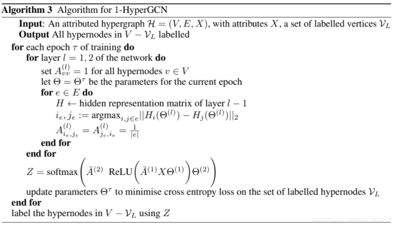

   * **HyperGCN**

     ​		利用超节点 $K_{e}:=\left\{k \in e: k \neq i_{e}, k \neq j_{c}\right\}$ 作为介质（mediators），并分别连接 $i_e$ 和 $j_e$。每条超边所拓展出的所有小边权重之和为1。超边 $e$ 拓展成 $(2|e|-3)$ 条小边，将每个边权设置为 $\frac{1}{2|e|-3}$。

     > 由于Laplacian矩阵中元素是经过正则化的，所以要求每个超边中的小边权重和都要为1。而对于具有中介的图来说，在超边中每增加一个点都要多两条边，即$a_n-a_{n-1}=2=d，a_1=1，n=1,2,3...$，求解等差数列可以得到边数量为 $2|e|-3$，所以权重选择为 $\frac {1}{2|e|-3}$。$|e|$ 表示超边对应连接的节点数。

     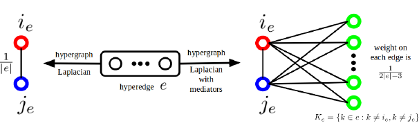

     **总结**：对于每条超边，先选距离最远的两个核心点，其他点再跟他相连（也就是在邻接阵中分配权重），然后成为加权普通图。每层每个epoch进行更新。

     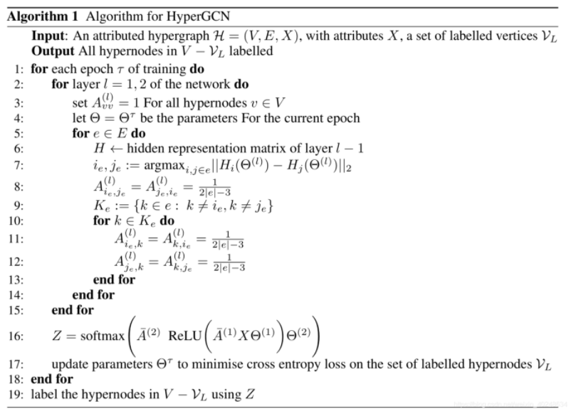

   * **FastHyperGCN**

     ​		利用初始的特征矩阵 $X$（无权重）构建超图拉普拉斯矩阵（具有介质）。注意：超图的拉普拉斯矩阵在训练之前只被计算一次。

     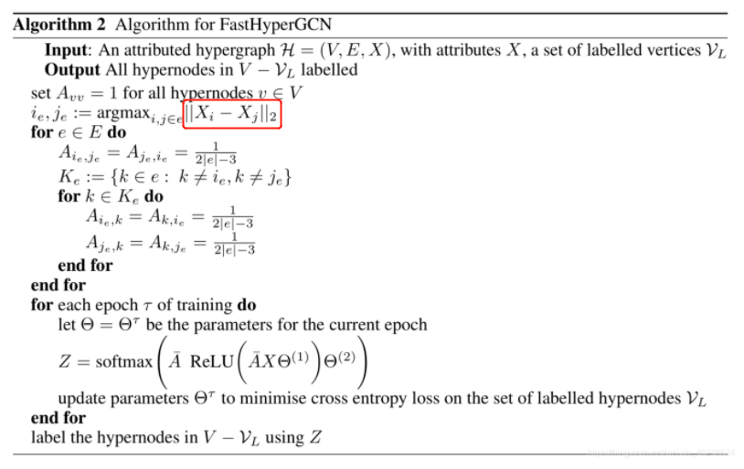

7. **实验结果**

   * 半监督学习任务

   

   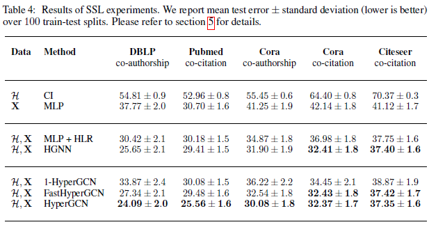

   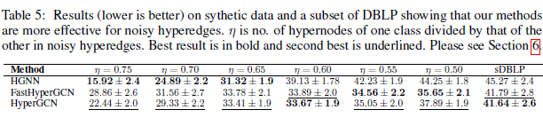

   ​		HyperGCN模型实验效果优于1-HyperGCN，原因在于在HyperGCN模型中每条超边的所有顶点均参与了超图拉普拉斯矩阵的构建，而1-HyperGCN仅有两个顶点。

   ​		在训练集中加入噪声，超边所有连接的顶点属于同一类称为纯的，而超边不全是同一类的称为有噪声的。表5结果，发现加入越多噪声对我们HpyerGCN越有利，这是因为HGCN其连接的是更多相似的节点。

   （其他实验具体见论文）

### 12. Line Hypergraph Convolution Network:Applying Graph Convolution for Hypergraphs

1. **出版**：ArXiv 2020

2. **源码**： [https://bit.ly/2qNmbRn](https://bit.ly/2qNmbRn)貌似打不开？？

3. **类型**：无向超图；线图(line  graph)

4. **目的**：首次在超图上引入线图的概念，在超边大小可变的超图上实现图卷积。

5. **思想**：在超图上构建线图如下：

   * **线图上节点和边的确定**：为每条超边 $e$ 都创建节点 $\mathbf v_e$，即 $V_{L}=\left\{\mathbf{v}_{e} \mid e \in E\right\}$。并且如果两条超边至少共享一个超节点，那么其在线图上对应的两节点相互连接，即 $E_{L}=\left\{\left\{\mathbf{v}_{e_{p}}, \mathbf{v}_{e_{q}}\right\}|| e_{p} \cap e_{q} \mid \geq 1, e_{p}, e_{q} \in E\right\}$ 。其对应的边权计算如下：
     $$
     w_{p, q}=\frac{\left|e_{p} \cap e_{q}\right|}{\left|e_{p} \cup e_{q}\right|}
     $$

   * **线图上节点特征的确定**：对于线图上的节点 $\mathbf v_e \in V_L$ ，其特征为对应的超边 $e$ 上所有超节点的平均特征，即 $\mathrm{X}_{\mathbf{v}_{e}}=\frac{\sum_{v \in e} x_{v}}{|e|}$ 。

   * **线图上节点标签的确定**：对于线图上的节点 $\mathbf v_e \in V_L$ ，只要对应的超边 $e$ 上至少存在一个有标签的超节点，则 $\mathbf v_e$ 具有标签。并且其标签类型取决于对应超边 $e$ 上出现次数最多的超节点类别。

     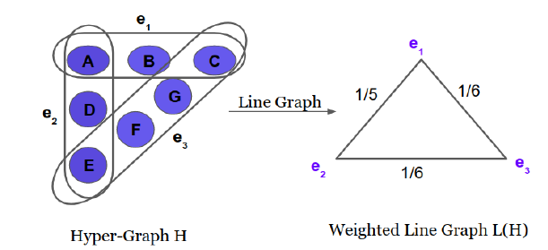

     ​		在线图中应用两层图卷积，其中 $\hat A = A+I$ 是线图上的邻接矩阵，即 $a_{pq}=w_{pq}$ 。$\sigma()$表示非线性的激活函数，作者采用$\text{ReLU}$函数。$H$ 是线图上最后一层隐藏层的节点表示，被喂入softmax层后使用交叉熵进行节点分类。
     $$
     H=\sigma\left(\hat{D}^{-\frac{1}{2}} \hat{A} \hat{D}^{-\frac{1}{2}} \sigma\left(\hat{D}^{-\frac{1}{2}} \hat{A} \hat{D}^{-\frac{1}{2}} \mathrm{X} \Theta^{(1)}\right) \Theta^{(2)}\right)
     $$
     ​		通过线图上图卷积的训练，我们可得到线图上的所有节点（超图上的超边）的特征表示和其标签类别。那么对于超图上未标记的超节点而言，其标签取决于所属的所有超边中占比最高的标签。而其特征表示为所属的所有超边的平均特征表示。

   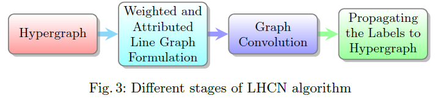

6. **实验结果**

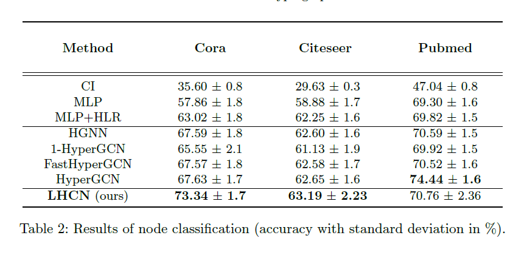

### 13. Learning Graph Pooling and Hybrid Convolutional Operations for Text Representations

1. **出版**：WWW 2019

2. **源码**：[https://github.com/HongyangGao/hConv-gPool-Net](https://github.com/HongyangGao/hConv-gPool-Net)

3. **类型**：无向图

4. **目的**：hConv-gPool-Net模型提出新的卷积和池化操作，以快速增加感受野的范围，并自动提取<u>具有语序信息</u>的高级特征。

5. **思想**：传统的GCN模型及其变体没有考虑文本中的语序信息，即不能自动提取节点的高级特征，同时目前还没有有效的池化操作应用在图模型上。因此该模型采用hConv卷积操作和gPool池化操作解决文本分类问题。
   * **构图**：采用Gow（graph-of-words）方法构建一个无权无向图，即weight=01。首先对文本进行预处理（分词和数据清洗等），基于词性标注选择文本中不同的术语terms（动词、形容词或名词等）作为节点，而两个术语terms间是否连线取决于其在滑窗内的词共现关系。滑窗大小取决于所有文本的平均长度。该模型通过拼接词嵌入（word embedding）和位置嵌入（position embedding）以初始化节点特征。对于词嵌入，其采用fastText预训练后的词向量，有效避免较多的未登录词。同时位置嵌入方法可将词在文本中的位置编码成独热向量。
   
     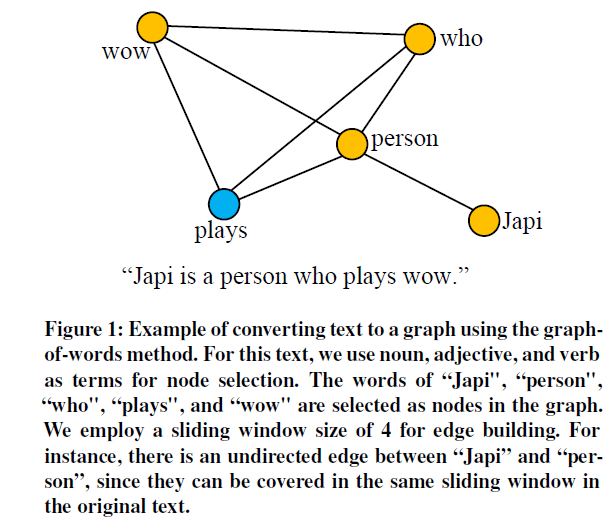
   
   * **gPool层**：与《Graph U-nets》中类似，具体细节可参考
   
     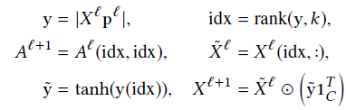
   
   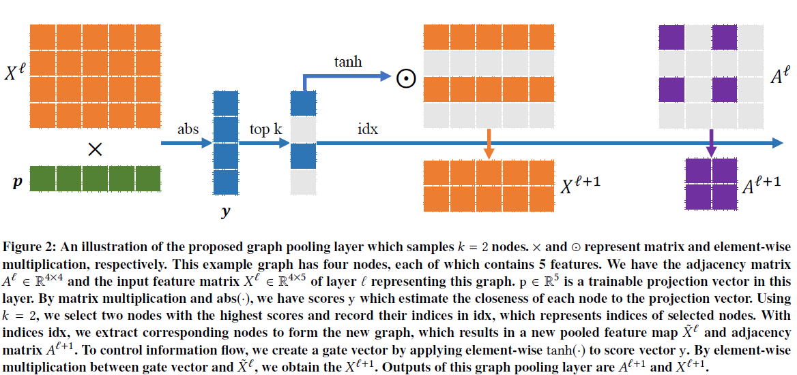
   
   * **hConv层**：结合传统的GCN操作以及一维CNN卷积操作。对于特征矩阵 $X^{\ell}$ ，列维度被视作通道维度（channel dimension），即列通道始终为1。$X_1^{\ell+1}$ 和 $X_2^{\ell+1}$ 通过矩阵拼接输出 $X^{\ell+1}$ 。
   
     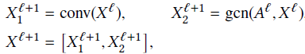
   
     ​		GCN和CNN两者操作互补。为了避免产生较多的参数，在CNN层中一般采用尺寸较小的卷积核，从而使特征图上的感受野增长缓慢，而<u>GCN操作可通过节点间的连接快速增大感受野</u>。与此同时，由于没有可训练的空间卷积核，所以GCN操作不能自动提取<u>具有语序信息的文本特征</u>，而CNN可以弥补这一缺点。因此hConv操作应用在基于本文的图数据上特别有效。

     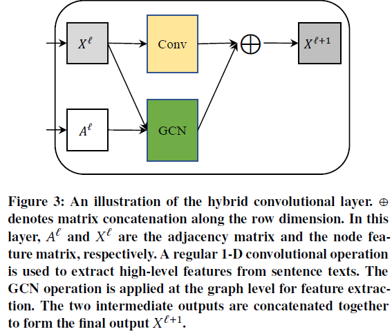
   
6. **实验**

   * **网络结构**

     * **GCN-Net**：堆叠4个标准的GCN层，从第二层开始，在每层的输出结果中应用一个全局最大池化层（global max-pooling layer），将这些池化层的输出结果拼接在一起，并喂进全连接层以进行最终的预测。

     * **GCN-gPool-Net**：基于GCN-Net，从第二层开始在GCN层后面增加一个gPool层（最后一层除外）。对于每层gPool层而言，挑选超参数 $k$ 使节点数减少至一半。其他部分与GCN-Net保持一致。

     * **hConv-Net**：在GCN-Net中，用hConv层代替所有的GCN层，其每层输出的特征图深度与对应的GCN层保持一致。假设最初的第 $i$ 层GCN层输出 $n_{out}$ ，那么对应的CNN卷积层和GCN层均输出 $\frac{n_{out}}{2}$ 个特征图。通过拼接，hConv层输出 $n_{out}$ 个特征图。其他部分与GCN-Net保持一致。

     * **hConv-gPool-Net**：基于hConv-Net，在除第一层和最后一层外的每层hConv层后面增加gPool层，如图所示：

       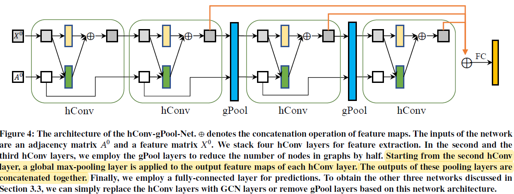

   * **数据集**：

     * **AG’s News** is a news dataset containing four topics: World, Sports, Business and Sci/Tech. The task is to classify each news into one of the topics.
     * **Dbpedia** ontology dataset contains 14 ontology classes. It is constructed by choosing 14 non-overlapping classes from the DBPedia 2014 dataset. Each sample contains a title and an abstract corresponding to a Wikipedia article.
     * **Yelp Polarity** dataset is obtained from the Yelp Dataset Challenge in 2015. Each sample is a piece of review text with a binary label (negative or positive).
     * **Yelp Full** dataset is obtained from the Yelp Dataset Challenge in 2015, which is for sentiment classification. It contains five classes corresponding to the movie review star ranging from 1 to 5.

   * **实验结果**

     * **文本分类**

     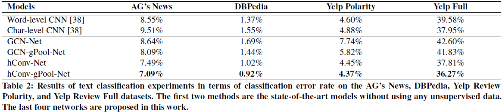

     * **消融实验**：与《Graph U-nets》类似

       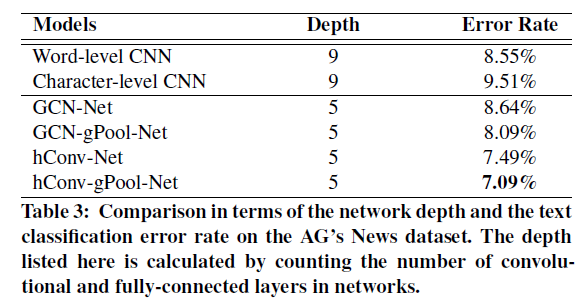

       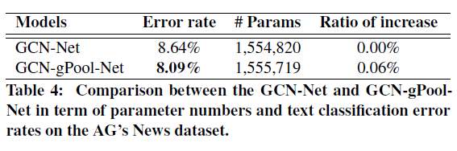

### 14. Inductive Representation Learning on Large Graphs

### 15. Simplifying Graph Convolutional Networks

## 待读

###  Text Graph Transformer for Document Classification

1. **出版**：EMNLP 2020
2. **源码**：

###  7. FastGCN： fast learning with graph convolutional networks via importance sampling

